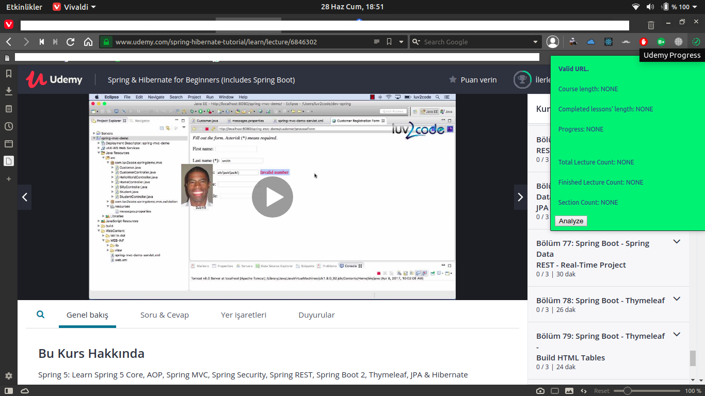
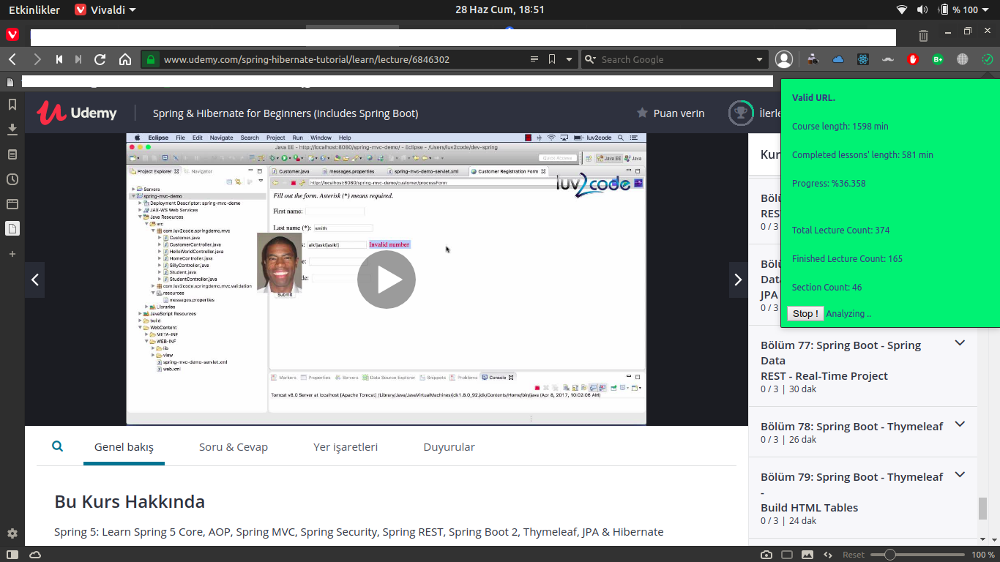
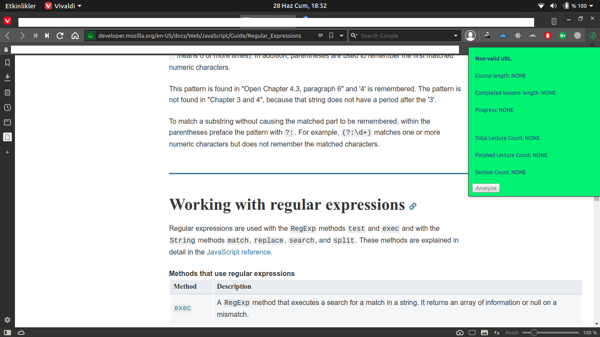

## Udemy Progress
    This is simply an extension which calculates your progress on udemy lecture

### Why 
    Because udemy's progress feature is terrible, it calculates your progress simply
by the count of lectures you've watched / total. 40 minutes lecture and 1 minute lecture is not SAME

### How
    It activates only on your course page. Since not all the lectures are loaded on DOM, 
It needs to do some clicks. Don't worry, it will still only take couple of seconds.

#### Sample Pictures

